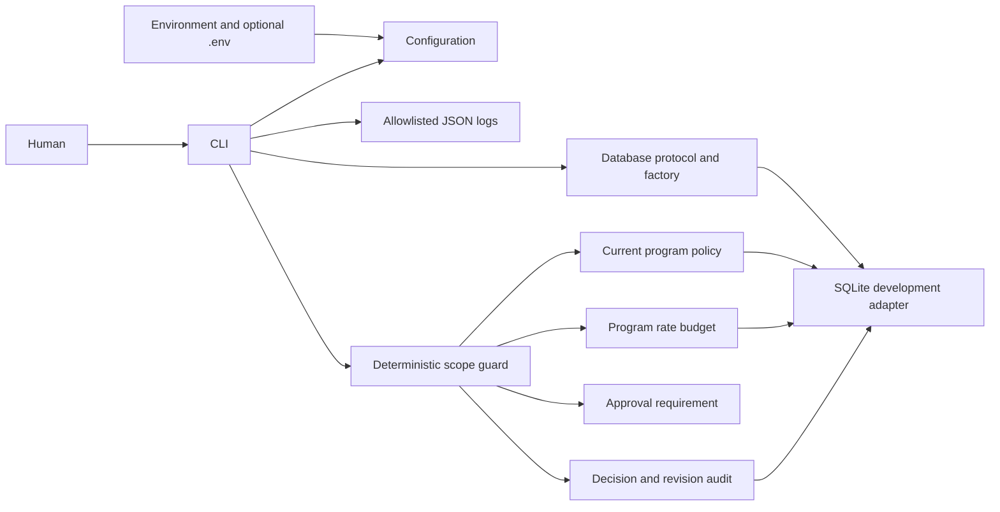

# Phase 1 architecture

`abh/config.py` loads validated immutable settings. `abh/cli.py` owns command dispatch and correlation IDs. `abh/logging.py` emits only fixed event fields; it does not serialize configuration, exception text, prompts or arbitrary messages. Logs rotate at 1 MB with three backups.

`abh/database.py` defines a storage protocol and SQLite adapter. Initialization uses an immediate transaction, a schema version and migration history, and closes connections deterministically. Health checks use a read-only connection. Version 2 adds programs, historical policy revisions, scope rules, action policies, rate limits, rate observations/reservations and decision audits. The migration from Phase 0 is transactional. PostgreSQL is an architectural extension point, not an implemented integration; this protocol does not promise SQL portability.

`abh/policy.py` defines strict program contracts and DNS-free target normalization. `abh/programs.py` persists policies atomically, retains previous revisions and verifies the content hash on reads. `abh/scope.py` evaluates exclusions before inclusions, then actions, rate availability and approval requirements. Guard decisions and rate reads occur under a database write transaction so concurrent imports cannot mix revisions in a decision. Rate reservations use separate transactions and are budget operations only; actual tool authorization and dispatch do not exist yet.

There is no remote service or dashboard. Local file access is the authorization boundary of this development-only version. Authentication, tamper-resistant audit storage and database secret management need later design. Content hashes identify revisions and detect inconsistent edits; they are not signatures and do not resist a malicious database owner.
