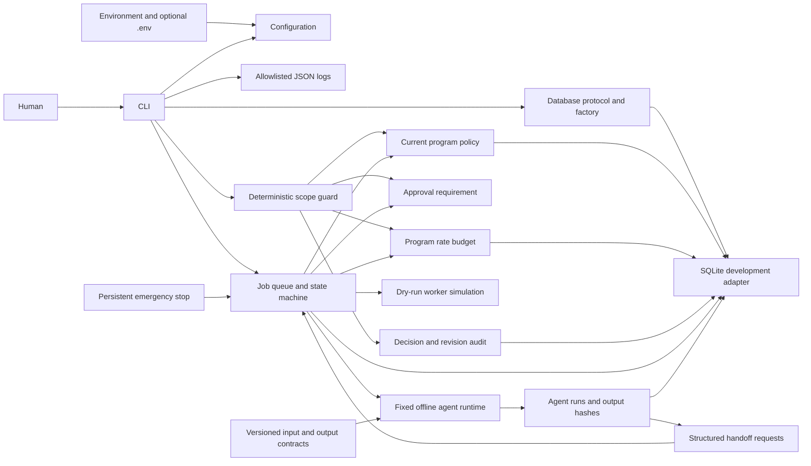

# Phase 3 architecture

`abh/config.py` loads validated immutable settings. `abh/cli.py` owns command dispatch and correlation IDs. `abh/logging.py` emits only fixed event fields; it does not serialize configuration, exception text, prompts or arbitrary messages. Logs rotate at 1 MB with three backups.

`abh/database.py` defines a storage protocol and SQLite adapter. Initialization uses an immediate transaction, a schema version and migration history, and closes connections deterministically. Health checks use a read-only connection. Version 2 adds programs, historical policy revisions, scope rules, action policies, rate limits, rate observations/reservations and decision audits. The migration from Phase 0 is transactional. PostgreSQL is an architectural extension point, not an implemented integration; this protocol does not promise SQL portability.

`abh/policy.py` defines strict program contracts and DNS-free target normalization. `abh/programs.py` persists policies atomically, retains previous revisions and verifies the content hash on reads. `abh/scope.py` evaluates exclusions before inclusions, then actions, rate availability and approval requirements. Guard decisions and rate reads occur under a database write transaction so concurrent imports cannot mix revisions in a decision. Rate reservations use separate transactions and are budget operations only; actual tool authorization and dispatch do not exist yet.

There is no remote service or dashboard. Local file access is the authorization boundary of this development-only version. Authentication, tamper-resistant audit storage and database secret management need later design. Content hashes identify revisions and detect inconsistent edits; they are not signatures and do not resist a malicious database owner.

`abh/jobs.py` owns Phase 2 orchestration. Schema version 3 adds `jobs`, `job_events`, `approvals`, `engine_control` and `engine_events`. Jobs have one fixed destination agent derived from their type, plus source agent, target, method, policy revision, attempt bound, correlation ID and optional idempotency key. Routing metadata is not an agent runtime.

Create/review/claim/finish/cancel operations are transactional. A claim rechecks current policy, bound human approval, global concurrency and program budget before assigning a lease token. Retry or cancellation clears the lease. Expired tokens cannot complete work. Policy changes block existing jobs; a new job and new approval are required. Completion produces only a fixed simulation result, never fabricated evidence or reports.

Phase 3 adds `abh/agent_contracts.py` (registry and schema validation), `abh/agents.py` (base agent protocol and five offline handlers), and `abh/agent_runtime.py` (dispatch, result validation and handoff orchestration). Schema 4 stores immutable-by-API `agent_inputs`, per-attempt `agent_runs` and `agent_handoffs`. A claim records its run atomically. Finishing a run, storing its output hash and completing its job happen in one transaction after rechecking lease and policy. Generic simulation workers cannot consume agent jobs.

Inputs are stored with the original job before approval and included in the enqueue fingerprint. Handoffs preserve the parent program, target and correlation ID, require a completed agent result, enforce the allowed next-agent route and create a new job that requires approval. An idempotency key and unique parent/destination constraint prevent duplicate children. Historical legacy jobs and their fingerprints remain compatible.
