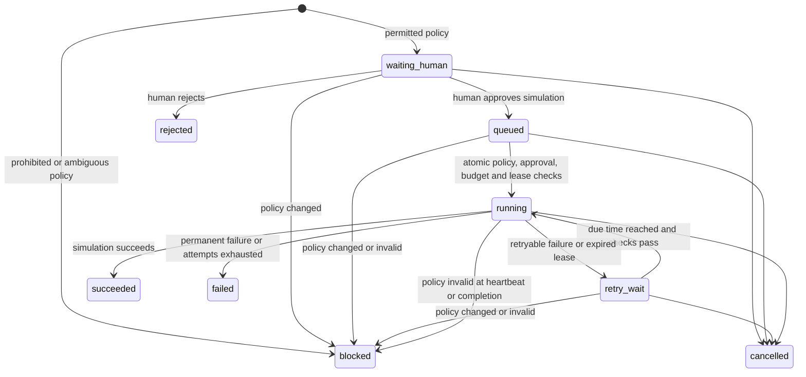

# Jobs and dry-run orchestration

Phase 2 provides persistent queue mechanics. It does not include the agent framework, tool runners, network calls, model calls or report submission. Every result is labelled `dry_run_simulation` with `tool_executed=false` and `network_requests=0`.

## State machine

`blocked`, `rejected`, `cancelled`, `failed` and `succeeded` are terminal. There is no command that forcefully marks a blocked job approved, resets an exhausted attempt count or revives cancelled work. Create a new job when inputs or policy change.

## CLI

| Command | Behavior |
| --- | --- |
| `jobs create TARGET --program ID --action ACTION --method HEAD` | Normalize inputs, pin current policy and create a waiting or blocked job |
| `jobs create ... --key REQUEST_ID` | Reuse the exact original request; conflicting reuse errors |
| `jobs list --status queued --owner mapper` | Filter persisted jobs |
| `jobs show JOB_ID` | Show inputs, status, event history and approval records; omit lease token |
| `jobs approve JOB_ID` | Recheck policy and approve this dry-run job only |
| `jobs reject JOB_ID` | Record rejection |
| `jobs cancel JOB_ID` | Cancel any nonterminal job and invalidate its lease |
| `jobs routes` | Show fixed action-to-owner routing |
| `jobs run-next --owner mapper --worker local-worker` | Claim and simulate at most one ready job |
| `jobs run-next ... --outcome transient_failure` | Simulate a retryable failure for local testing |
| `jobs run-next ... --outcome permanent_failure` | Simulate a non-retryable failure |
| `jobs recover` | Recover expired worker leases without executing jobs |
| `orchestrator status` | Show persisted stop flag, concurrency limit and state counts |
| `emergency-stop` | Persist stop, cancel active jobs and invalidate current worker leases |
| `orchestrator resume` | Reopen admission without reviving cancelled jobs |

All commands use the `python -m abh` prefix unless the package is installed. `--actor` on review/cancellation/control commands is an audit label, not authentication. Only the local human should invoke review commands. Role authentication and a secured approval UI are not implemented.

Exit code 3 means waiting for human approval; 1 means blocked, failed, rejected or an error; 0 means the command succeeded or no dispatchable job was found. Read the JSON `status` to distinguish an idle worker from a completed simulation. `jobs show` reflects the job's state in its exit code even though the lookup itself succeeded.

## Ownership and retries

Routing is fixed by action, not chosen by an LLM. Mapper owns asset discovery/DNS/HTTP probes; crawler owns URL/JavaScript collection; validator owns candidate validation and response comparison; evidence owns artifact tasks; reporter owns report-submission simulations; tester owns analysis and sensitive-test simulations. These names are metadata only until Phase 3.

Queue claims run under an immediate SQLite transaction. Global running-job capacity is two across all owners and workers sharing the same database. Claims use FIFO order by creation timestamp and job ID; rate-limited jobs do not block ready jobs from another program. Rate deferral preserves attempts and leaves the job queued or waiting for retry.

Each claim increments attempts and creates a unique lease token. Leases default to 30 seconds and can be extended through `JobQueue.heartbeat()`. Workers must present matching job ID, worker ID and token, before lease expiry, to publish a result. A token is omitted from ordinary list/show output and from audit events. It is a local concurrency fence, not remote-worker authentication.

Transient errors and lease expiry schedule a retry after 5, 10, 20... seconds, capped at 300. Maximum attempts default to three and must be between one and five. Permanent failures do not retry. Retry scheduling survives restarts. Recovery happens on the next claim or explicit `jobs recover`; there is no background scheduler yet.

## Policy, approval and budgets

Approval is bound to one job's immutable inputs and its policy revision. Any policy replacement that changes its hash invalidates that job on the next review, claim, heartbeat or completion. Expired/ambiguous/excluded policy never becomes permissible by approval. This local approval permits only a dry-run simulation and must never be carried forward as authorization for live execution.

Each successful claim reserves one unit from the existing program-wide rate budget in the same transaction as ownership assignment. Dry-run reservations are conservatively counted; they do not represent actual requests. Failed or cancelled attempts are not refunded. Rate errors cannot increment attempts. Query-bearing job URLs are rejected in this phase rather than silently dropping query parameters.

Clock rollback blocks new work and resume until the recorded time is reached. Cancellation and emergency stop remain available during rollback. Persisted rate and queue clocks are separate checks. Host clock tampering, distributed clocks and malicious direct edits to the database are outside this local development boundary.

## Audit and stop semantics

Each job event records actor, event, prior/new status, fixed reason code, attempt, time and correlation ID. The job record supplies target, action, program, owner and policy revision. State change, approval and event inserts commit or roll back together. Arbitrary exception strings, headers, credentials and request bodies are not accepted as job results.

Emergency stop cancels waiting, queued, running and retrying simulations in one transaction. New creates, approvals, claims, heartbeats and completions are then rejected. Resume requires an explicit command and does not restore any cancelled job. Since no tool processes exist, there is no OS process termination claim; future runners must integrate cooperative cancellation and enforce the stop flag before every tool action.

This queue has no untrusted remote-worker boundary, background service, distributed database, pagination or retention policy yet. It must not be exposed as a production API without the later hardening work.
